# OPNSense Homelab.

### OPNsense es un firewall de código abierto basado en FreeBSD, diseñado para ser una solución completa de seguridad de red. Está enfocado en ser seguro, estable y fácil de administrar, con una interfaz web moderna.

### Fue creado como un fork de pfSense en 2015, con el objetivo de mejorar la transparencia del desarrollo y ofrecer una interfaz más moderna.

### OPNsense se utiliza como:
-   ### Firewall y router avanzado
-   ### Sistema de detección y prevención de intrusiones (IDS/IPS)
-   ### VPN concentrator (OpenVPN, IPsec, WireGuard)
-   ### Proxy y filtrado web
-   ### Controlador de ancho de banda
-   ### Sistema de prevención de fugas DNS y bloqueo de publicidad
-   ### Gateway de red para múltiples VLANs
-   ### Captive Portal (útil en redes WiFi públicas o de hoteles)

### Características clave:
-   ### Interfaz web = Gestión 100% vía navegador, no requiere línea de comandos.
-   ### Firewall stateful = Usa pf (Packet Filter) para manejar reglas de tráfico.
-   ### VPNs = Soporta OpenVPN, IPsec y WireGuard.
-   ### IDS/IPS = Integra Suricata para detección de amenazas en tiempo real.
-   ### Plugins = Tiene un sistema modular para agregar funcionalidades como Sensei (filtrado avanzado), WireGuard, Zabbix Agent, etc.
-   ### Monitoreo = Gráficos de tráfico, logs en tiempo real, informes del sistema.
-   ### Multi-WAN = Soporta balanceo de carga y failover de múltiples conexiones a Internet.

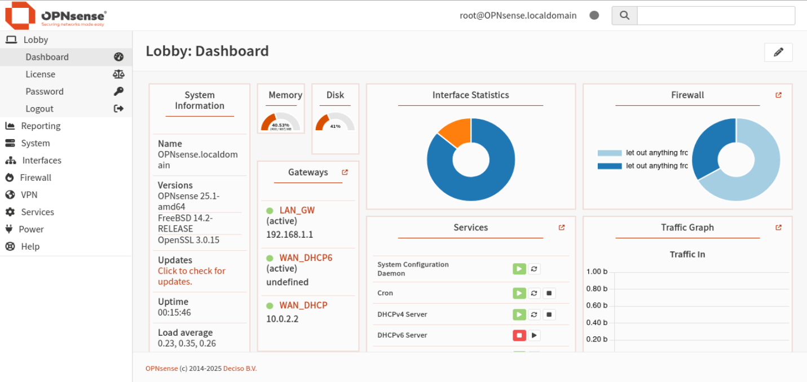

## Instalacion.

### Se puede instalar en hardware real, en máquinas virtuales (como VirtualBox, Proxmox, VMware) o incluso en entornos en la nube (como Azure o AWS).

### En este caso se usara Virtualbox para el despliegue de la maquina, descargando la iso de la pagina oficial (
### https://opnsense.org/download/
### ) y empezar con la instalacion.

### Dentro de virtualbox se empezo a desplegar la maquina usando la imagen oficial de opnsense, y aclarando que el tipo de sistema es BSD (ya que en este sistema esta basado opnsense) y dandole una version de 64 bits.

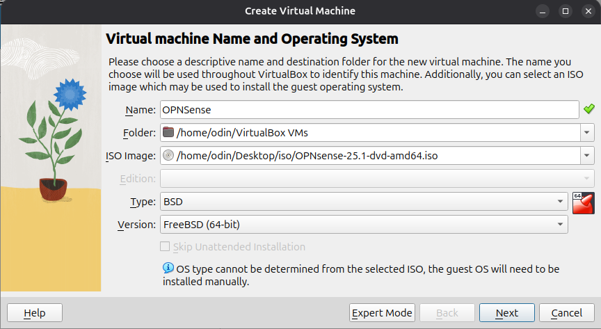

### En la maquina se usaron los recursos minimos ya que solo se usara para fines de laboratorio, estas pruebas fueron de alto rendimiento, y tampoco interactuaron muchos equipos.

### En caso de crear una red amplia de laboratorio se recomienda usar los parametros de configuracion recomendados por opnsense

### Requisitos mínimos:
  Requisitos   Detalles
  ------------ -----------
  CPU          x86_64
  RAM          1 GB
  DISCO        4 GB
  RED          LAN y WAN

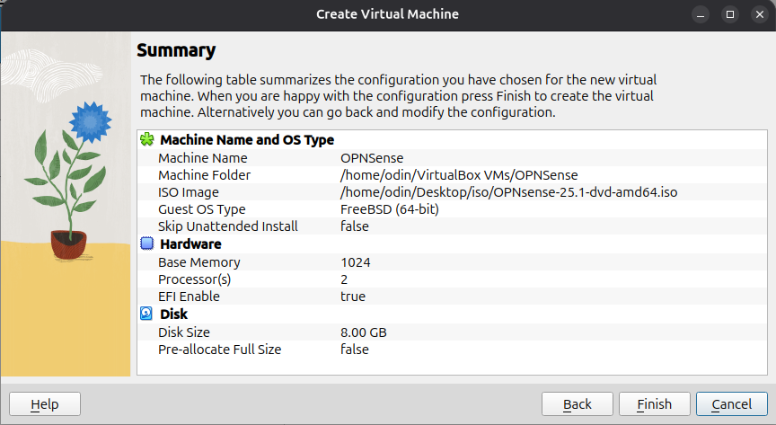

### Luego de crear la maquina hay que tener en cuenta el apartado red. Los adaptadores de red deben ser configurados de dos maneras ya que opnsense manejara dos interfaces de red, la interfaz conectada a la maquina fisica (el host que esta corriendo virtualbox) con el cual tendra acceso a internet, y el segundo adaptador estara conectado a las maquinas que haran las pruebas (El resto de las maquinas que se conecten a opnsense).

### El adaptador 1 usara un

### NAT

### , con el tipo de adaptador por defecto, nada muy rebuscado.

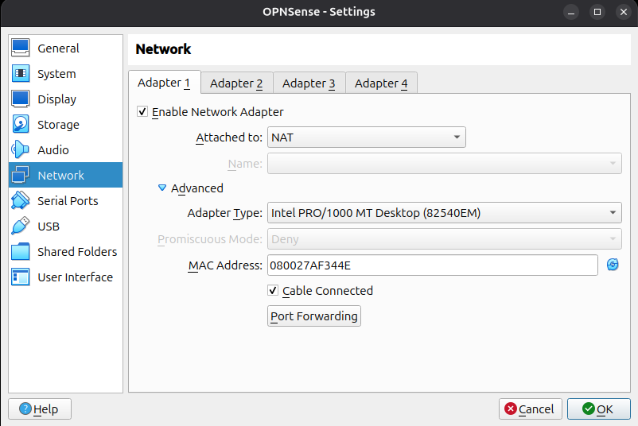

### En el segundo adaptador se especificara un

### Internal Network

### y usando el nombre

### intnet

### (mas facil de recordar).

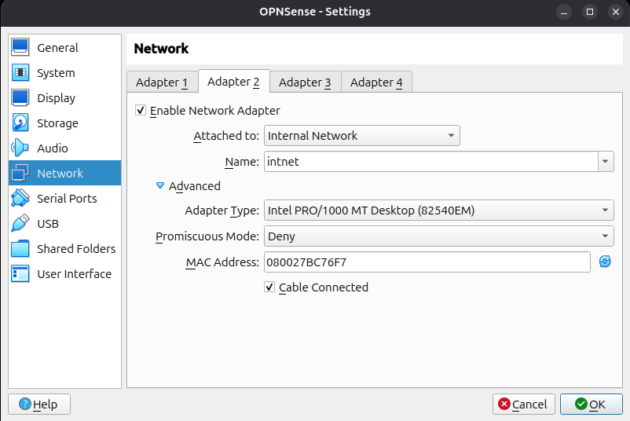

### Luego de iniciar la maquina esta ofrece la alternativa de instalar el sistema en un disco o seguir desde el instalador, esta desicion esta a criterio de quien la despliegue, ya que no afecta la funcionalidad.

### 

### Ya dentro de la maquina se tuvieron que configurar las interfaces, luego de seleccionar la opcion 1 en el menu para asignar las interfaces, es importante que opnsense reconosca los adaptadores de red correctamente.

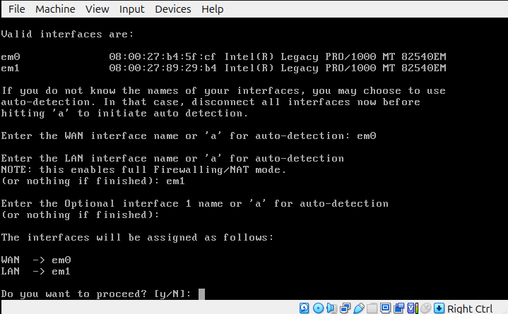

## Configuracion de las interfaces:

::: codebox
    #LAN (em1)

    IP address: 192.168.1.1
    Subnet mask: 24
    Gateway: (déjalo vacío)
    Enable DHCP on LAN: Yes
    Start: 192.168.1.100
    End: 192.168.1.200
:::

### En la interfaz WAN (em0) no se haran muchas configuraciones, pero si se agregara una ruta para que envie el trafico a la maquina host y obtenga acceso a internet.

::: codebox
    #ver las interfaces 
    netstat -rn

    #borrar la interfaz por defecto y agregar la de la maquina fisica
    route delete default
    route add default 10.0.2.2
:::

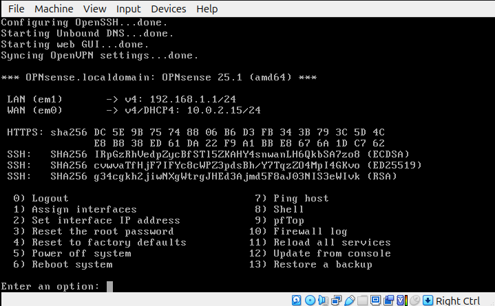

### Ya con la maquina configurada se recomendaria comprobar la conectividad con algun host web usando ping.

:::

::: page
[]{#Pruebas_4.html}

# Pruebas {#pruebas .title .level-1}

\
:::

::: page
[]{#Pruebas--Test_1_8.html}

# Test 1 {#test-1 .title .level-2}

\

## Captive portal.

### El

### Captive Portal

### es una funcionalidad que

### bloquea el acceso a Internet o a la red local hasta que el usuario se autentique

### a través de una página web.

### 

### El portal permite regular que usuarios acceden a la red, registrando quien se conecta, pudiendo expulsar usuarios indeseados, y pudiendo administrar los permisos de acceso a las redes, contando con un factor de seguridad para filtrar el acceso a una red privada o publica.

### 

### 

### 

### 

### Objetivo

### 

### Crear un Captive Portal en OPNsense que:

-   ### Intercepte conexiones desde la red LAN

-   ### Muestre una página de login

-   ### Permita navegar solo después de autenticarse

### 

### 

### 

### 

### Test #1

### 

### 

### 

### Dentro de opnsense en la ruta Services \> Captive Portal \> Administration se creara el portal. Este no requerira una configuracion compleja, sin necesidad de usuarios o claves.

### 

### El portal se configurara en la red LAN, el resto de las configuraciones estan predeterminadas.

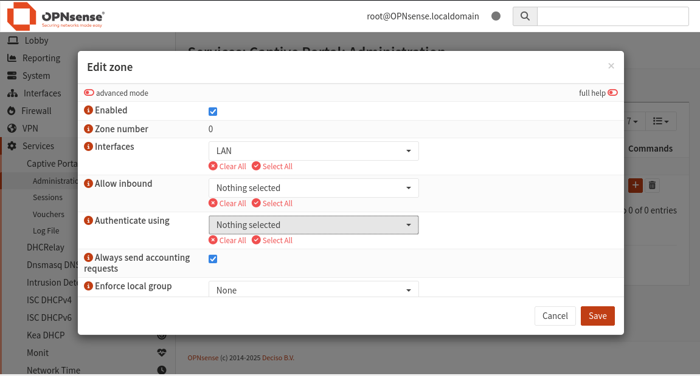

### El portal usa una plantilla predeterminada de opnsense (sin necesidad de usuario ni clave) para acceder a la red.

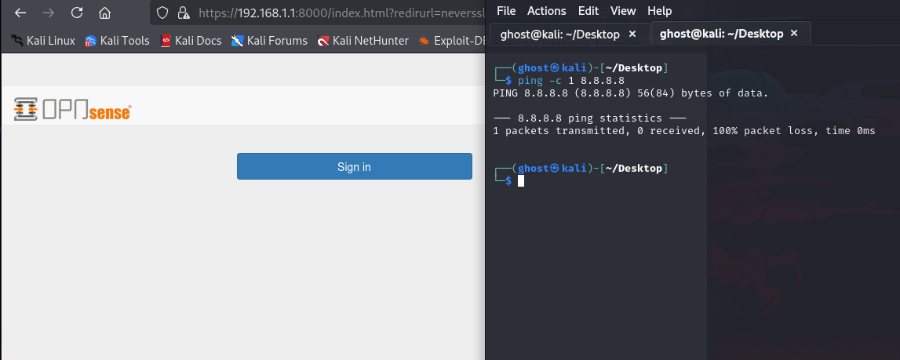

### Dentro de opnsense (Service \> Captive Portal \> Sessions) se puede ver que el usuario anonymous se registro en el sistema, viendo su ip, direccion MAC, etc.

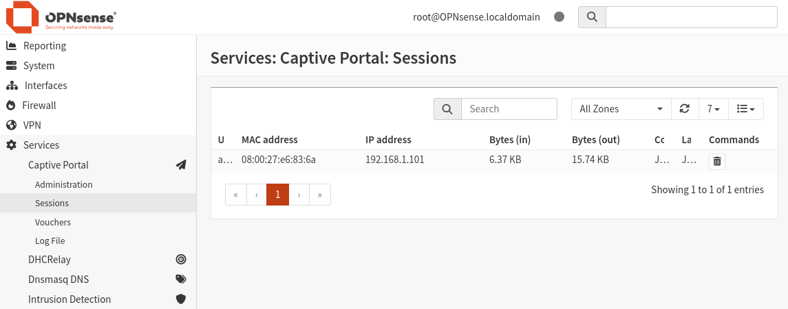

### Ya dentro de el portal se accedio a la red LAN, pudiendo comprobar con el comando ping la conectividad con internet.

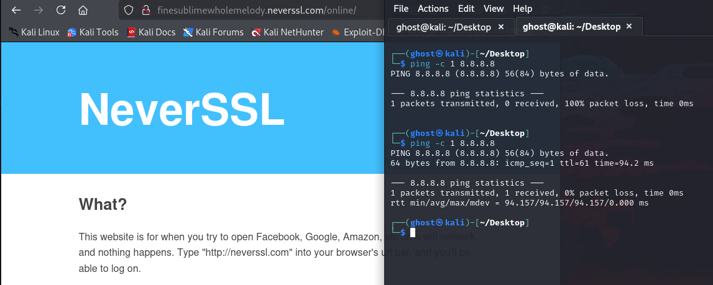

### Test #2

### 

### En la segunda prueba se creo un usuario llamado kali con la clave 12345, esta informacion es generica y solo para el ejemplo.

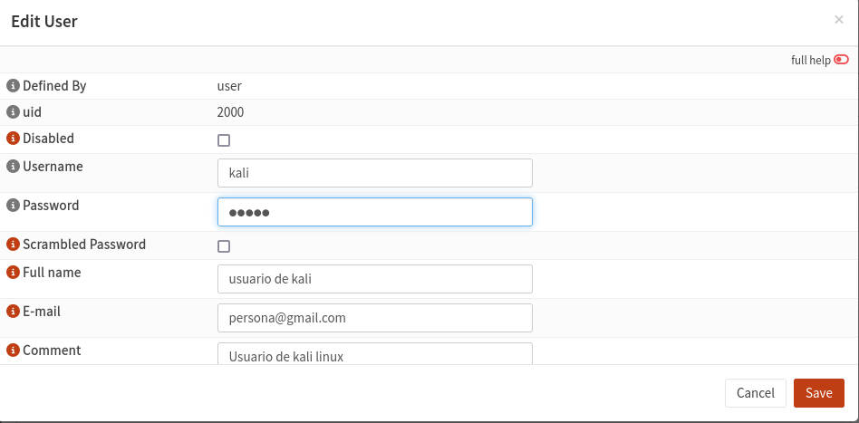

### En el area de grupos ( System \> Area \> Groups) se creo un nuevo grupo llamado users.

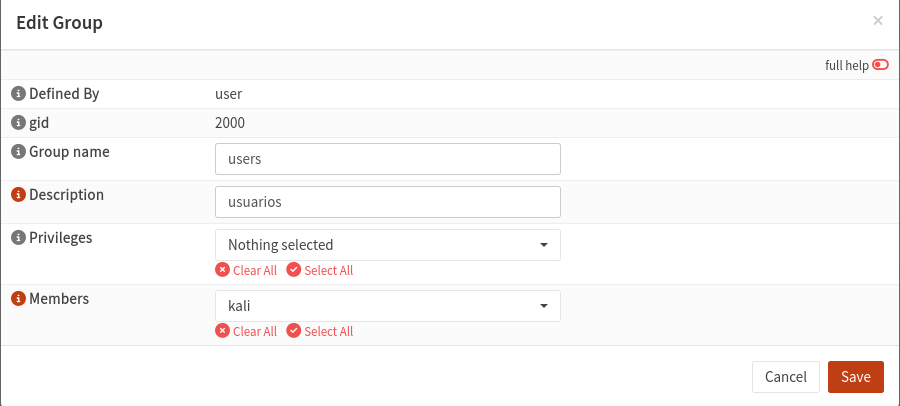

### En zone (Service \> Captive Portal \> Administration) se edito el portal, agregando el Local Database a el metodo de autenticacion.

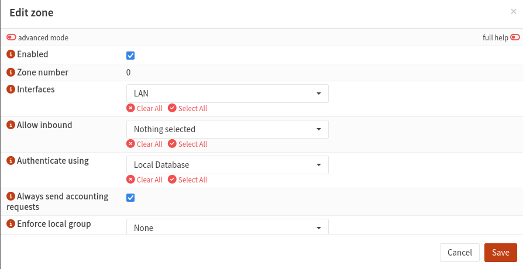

### La coneccion fue interceptada por opnsense, mostrando el panel de login, el cual solicita las credenciales.

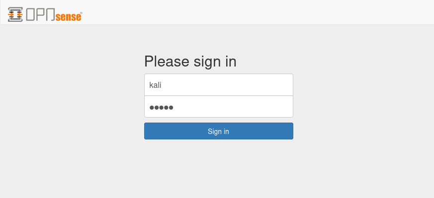

### Pudiendo acceder a internet luego de proporcionar las credenciales validas.

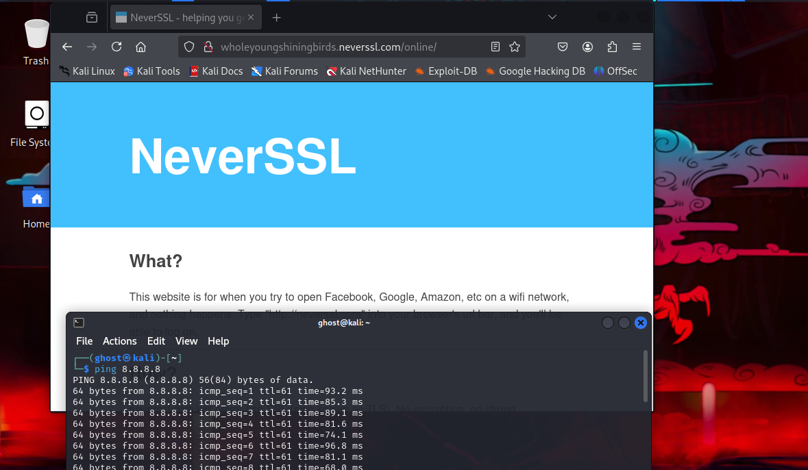luego
:::

::: page
[]{#Pruebas--test_2_9.html}

# test 2 {#test-2-1 .title .level-2}

\

## Block Firewall.

### Objetivo.

### 

### Crear una regla de firewall que:

### 

### • Intercepte y bloquee conecciones.

### 

### 

### 

### 

### Test #1

### 

### En el area de

### Unbound DNS

### se accedio a blocklist para configurar algunos dominios, el mantener este activado los dominios se bloquean desde el navegador.

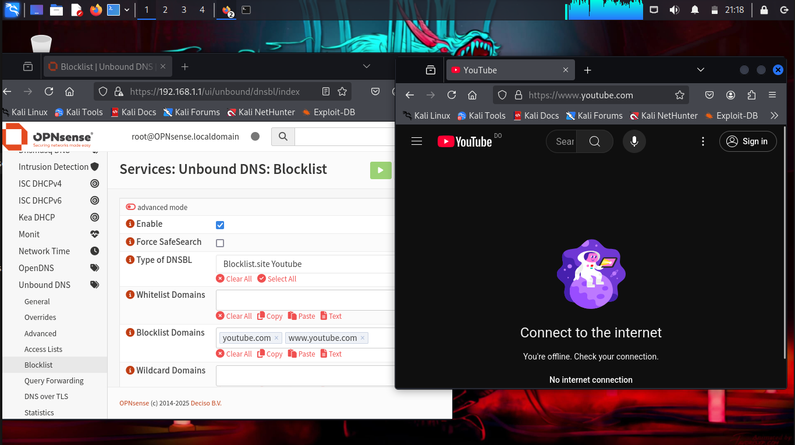

### Al desactivar el blocklist (aun estando configurado) se obtiene acceso sin restricciones a la pagina web.

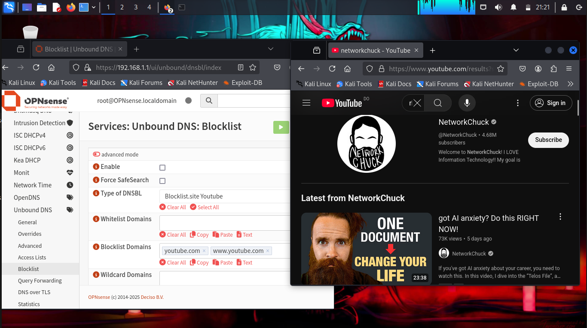

### Test #2

### 

### Accediendo a el area de

### Rules

### de

### Firewall

### se creo una nueva regla, una regla especifica para bloquear.

### 

### Con un simple escaneo de nmap se puede ver el puerto 80 abierto y listo para su uso.

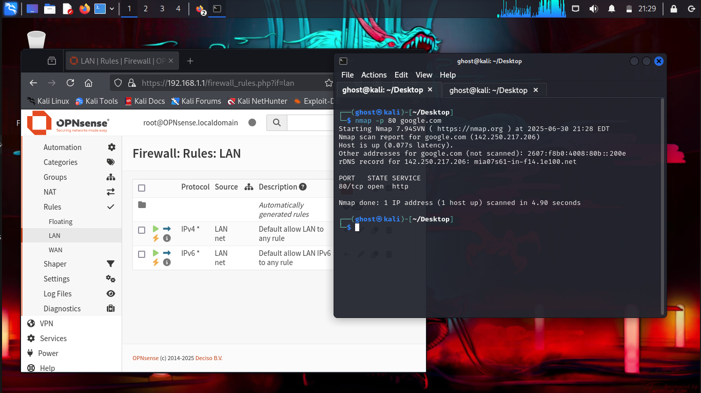

### La regla tiene algunos parametros especificos, agregando el protocolo

### TCP

### para bloquear y asignando tanto la direccion como la version de IP (y obviamente la interfaz) para crear la regla de firewall.

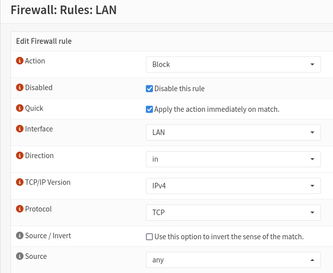

### Ya aplicando la regla al firewall se muestra que el escaneo de nmap muestra el puerto como filtered, no otorgando un acceso limpio a este debido a la nueva regla de bloqueo.

### 

### 

### Nota:

### las reglas se leen de arriba hacia abajo, las nuevas reglas deben ser colocadas arriba de las anteriores para evitar problemas de ejecucion.

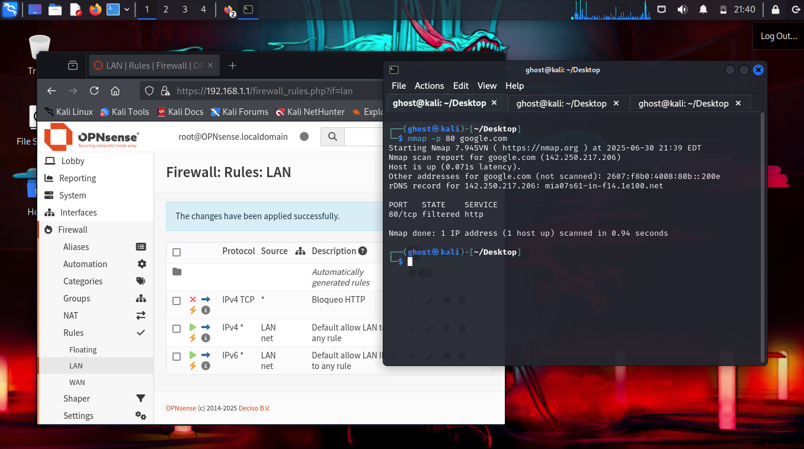
:::
